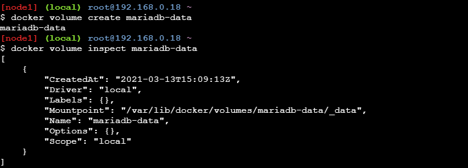
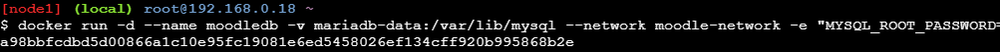
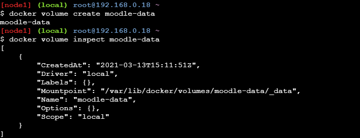
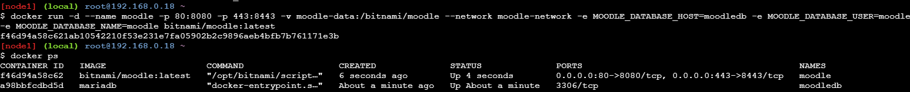
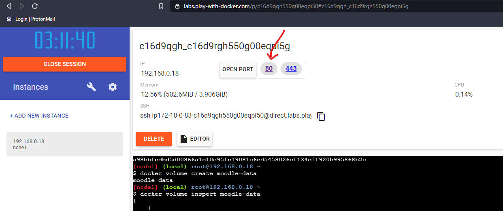
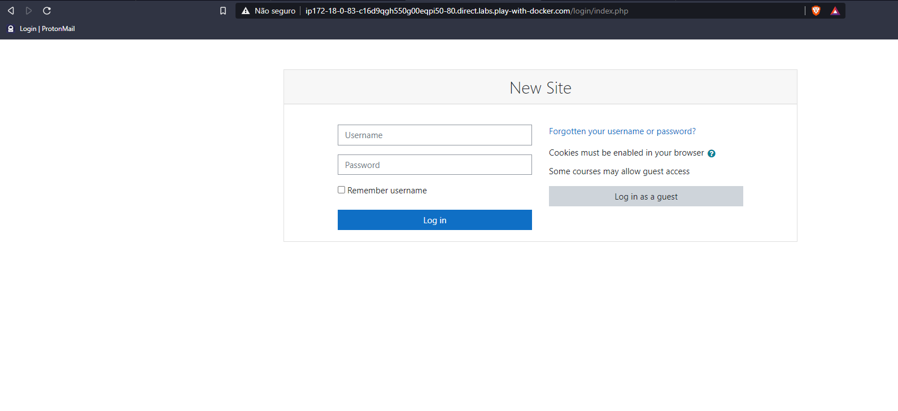
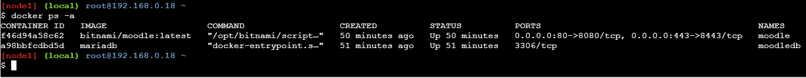

# Instalando a plataforma moodle (Docker)

Utilizei o tutorial fornecido pela techexpert para realizar essa tarefa
Você também pode acessá-lo por [aqui](https://techexpert.tips/pt-br/moodle-pt-br/moodle-instalacao-docker/)

### Criando um docker network 

```console
$ docker network create moodle-network
```
Estaremos utilizando uma network própria apenas para os conteineres que serão necessários para o funcionamento do moodle.

### Baixando imagens

Utilizaremos, a princípio, as imagens do mariadb e do moodle.

baixando imagem mariadb

```console
$ docker pull mariadb
```

Baixando a imagem do moodle
```console
$ docker pull bitnami/moodle
```

### Criando volume de persistencia

Criaremos um volume que será responsável por armazenar e garantir a persistencia do mariadb.

```console
$ docker volume create mariadb-data
```


Podemos, também, criar um link simbólico para um local de acesso facilitado, como a seguir:

```console
$ ln -s /var/lib/docker/volumes/mariadb-data/_data /mariadb
```

### Iniciando o conteiner MariaDB com persistência

Com o comando a seguir podemos iniciar um contêiner com o MariaDB utilizando o network já predefinidio por nós e apontando o volume persistente, a senha da conta root utilizada neste exemplo é o próprio kamisama123 sugerido no tutorial, mas pode ser substituido pela senha que melhor convier ao caso.

```console
$ docker run -d --name moodledb -v mariadb-data:/var/lib/mysql --network moodle-network -e "MYSQL_ROOT_PASSWORD=kamisama123" -e MYSQL_USER=moodle -e "MYSQL_PASSWORD=kamisama123" -e "MYSQL_DATABASE=moodle" mariadb
```

Deverá retornar algo como:



Um banco de dados foi criado, chamado moodle, com a mesma senha do root, agora vamos criar um volume docker para armazenas os dados persistentes no moodle.

```console
$ docker volume create moodle-data
```

ao inspecionar o volume criado, será retornado algo como:


Também criaremos um link simbólico para facilitar, neste caso.
```console
$ ln -s /var/lib/docker/volumes/moodle-data/_data /moodle
```
### Iniciando o Moodle com o BD persistente

Agora iremos iniciar o contêine Moddle com armazenamento de dados persistente, usando o comando:

```console
$ docker run -d --name moodle -p 80:8080 -p 443:8443 -v moodle-data:/bitnami/moodle --network moodle-network -e MOODLE_DATABASE_HOST=moodledb -e MOODLE_DATABASE_USER=moodle -e MOODLE_DATABASE_PASSWORD=kamisama123 -e MOODLE_DATABASE_NAME=moodle bitnami/moodle:latest
```
Assim, iniciamos mais um contêiner com o moodle utilizando o mariadb como banco de dados com uma persistência local. Ao utilizar o `docker ps` podemos ver nossos contêineres em execussão.



Assim, após alguns minutos, ja podemos acessar a página de login do nosso Moodle, geralmente em localhost, nós disponibilizamos na porta 80. Neste teste foi utilizado o [Play with Docker](https://labs.play-with-docker.com/) que disponibiliza o acesso apenas clicando na porta exposta, como mostrado nas imagens a seguir:


E aqui a pagina de login do moodle:



Aqui temos nossos contêineres ativos e funcionando:



### Comando úteis para a manutenção dos contêineres

Verificar status dos contêineres:
```Cosole
$ docker ps -a
```

Parar um contêiner:
```console
$ docker conteiner stop nomeDoConteiner
```

Iniciar um contêiner parado:
```console
$ docker conteiner start nomeDoConteiner
```
Reiniciar um contêiner:
```console
$ docker conteiner restart nomeDoConteiner
```

Em casos onde ocorrem erros, você pode usar o seguinte comando para ter acesso aos logs:
```console
$ docker logs nomeDoConteiner
```
